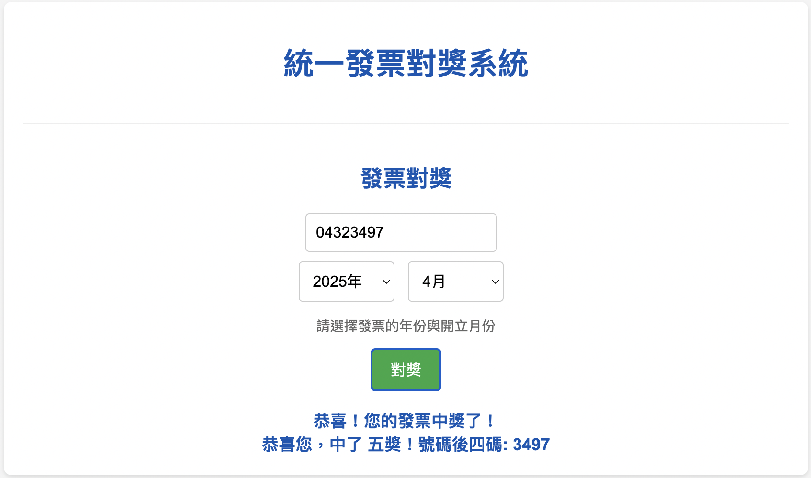

# 統一發票自動對獎系統

---

## 簡介

---

您是否曾為手動對獎統一發票感到繁瑣？

「**統一發票自動對獎系統**」是一個基於 Flask 開發的應用程式，旨在簡化您的發票對獎流程。它能夠自動從財政部電子發票平台抓取最新的開獎號碼，並提供一個直觀的網頁介面，讓您輕鬆輸入發票資訊進行即時對獎。

<div align="center">
  輕鬆管理發票，智慧對獎，讓中獎不再錯過！<br><br>
  <br>
</div>

## 功能介紹

---

- **智慧對獎功能**
  根據您輸入的發票號碼和開立日期，自動比對財政部公布的中獎號碼，判斷是否中獎並顯示您所中的最高獎項。

- **自動化開獎號碼抓取**
  內建網頁爬蟲，定期從財政部電子發票整合服務平台的網站上自動獲取最新的統一發票開獎號碼，並儲存至資料庫。

- **背景排程任務**
  利用 Flask-APScheduler 實現定時任務，確保開獎號碼資料庫始終保持最新狀態，無需手動更新。

- **資料庫儲存**
  使用 SQLAlchemy 將您的發票記錄和所有歷史開獎號碼持久化儲存，方便查詢和管理。

- **簡易前端介面**
  提供一個使用者友善的網頁介面，讓您可以快速輸入發票號碼和日期進行對獎。

## 使用技術

---

- **後端框架**：Python 3, Flask
- **資料庫**：PostgreSQL
- **ORM**：Flask-SQLAlchemy
- **網頁爬蟲**：Requests, BeautifulSoup4
- **排程任務**：Flask-APScheduler
- **環境管理**：python-dotenv
- **容器化**：Docker, Docker Compose
- **前端**：HTML, CSS, JavaScript (Vanilla JS)

## 版本及套件

---

- `Python` 版本：3.9 以上
- `PostgreSQL` 版本：16.x (或 `16-alpine` 兼容版本)

## 本地環境設定 (Setup)

---

請依照以下步驟在您的本地機器上設定並運行應用程式：

1.  **確保已安裝 Docker 和 Docker Compose**：
    您的系統需要安裝 Docker 和 Docker Compose 來運行此專案。如果尚未安裝，請參考官方文件進行安裝：
    * [Docker 官方安裝指南](https://docs.docker.com/get-docker/)

2.  **克隆專案儲存庫**：
    ```bash
    git clone [https://github.com/ab000641/invoice_lottery_checker.git](https://github.com/ab000641/invoice_lottery_checker.git)
    cd invoice_lottery_checker
    ```

3.  **建立 `.env` 環境變數檔案**：
    在專案的根目錄下建立一個名為 `.env` 的檔案，並填入資料庫連線所需的環境變數。
    ```env
    # .env 檔案內容範例 (請替換為您自己的值)
    DB_NAME=mydatabase_dev
    DB_USER=myuser_dev
    DB_PASSWORD=mypassword_dev
    # DATABASE_URL 會由 docker-compose.yml 自動組裝
    ```
    * **提示**：這些變數將用於 Docker Compose 啟動的 PostgreSQL 容器，用於本地開發。

4.  **使用 Docker Compose 啟動服務**：
    在專案根目錄的終端機中，執行以下命令來建置 Docker 映像檔並啟動所有服務。
    ```bash
    docker compose up --build -d
    ```
    這將會啟動 Flask 應用程式、PostgreSQL 資料庫和排程器服務。

5.  **訪問應用程式**：
    一旦服務啟動，您應該能夠在瀏覽器中訪問應用程式：
    ```
    http://localhost:5000
    ```

6.  **手動觸發首次開獎號碼抓取 (可選)**：
    應用程式會自動排程每 12 小時抓取一次開獎號碼，但您也可以手動觸發立即抓取：
    ```bash
    curl -X POST http://localhost:5000/fetch_awards
    ```